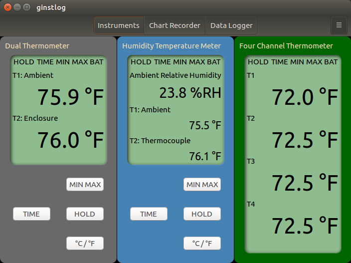
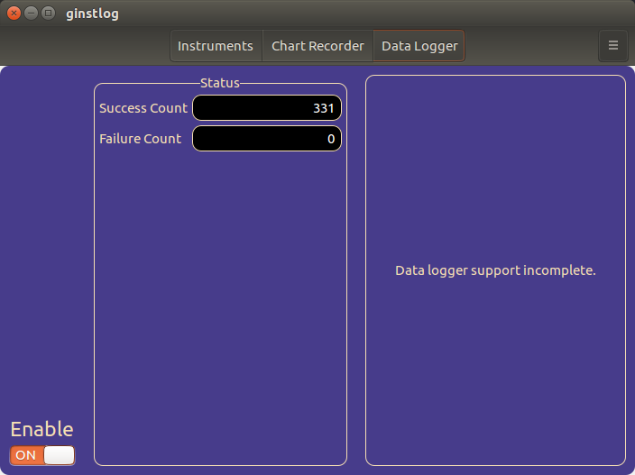

# ginstlog
This project implements a data logger for instruments.

:warning: __This project has not reached minimum viability.__

## Development
The following screenshot shows the application in development:

The following screenshot shows the data logger portion of the application:

## Instruments

The [instrument table](docs/Instruments.md) contains a list of instruments supported by ginstlog.

## Instructions

See [instructions](docs/instructions/index.md) for using ginstlog.
