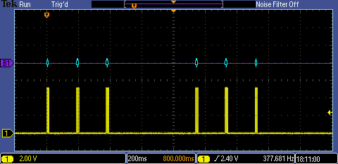
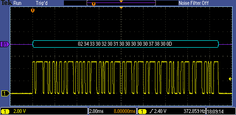
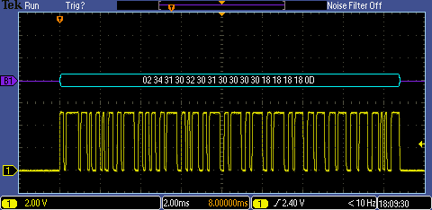

# MODES
In _Basic Thermocouple Mode_, all four channels transmit.

When in _T1-T2 Mode_, only three channels are transmitted.

In _HOLD Mode_, transmission stops.

# DATA
The following figures shows a channel transmitting normally.

The following figure shows a channel with an open loop input.

